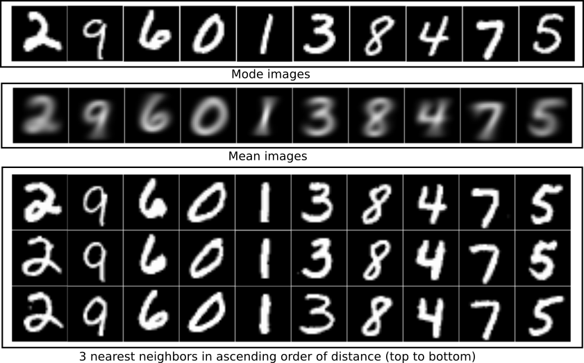

# SLK

This is the code for Scalable Laplacian K-modes (SLK) algorithm for large scale data clustering.

## Prerequisites

The code is run and tested with python 3.5 and need the following packages:

- pyflann
- annoy (if used as a option)

## Usage

We give the the example script [test_SLK.py](test_SLK.py) for MNIST dataset with Feature learned from running GAN network. The learned features is in [gan_mnist.mat](gan_mnist.mat) in data folder.  

To test simply run the following which run with tuned lambda and initial seed which get around 94% accuracy on MNIST 
```
python test_SLK.py
```

- To save the mode images and results set the parameters  in the line 27 and 28 to True
- To run options SLK-BO or SLK-MS change SLK_option in [test_SLK.py](test_SLK.py)
- To test with other datasets give the dataset as a feature array of form number of samples (N) x number of dimension (D) or according to the code.

## Modes
Example modes found with SLK for MNIST

<span></span>


## License

This project is licensed under the MIT License - see the [LICENSE.md](LICENSE.md) file for details.

